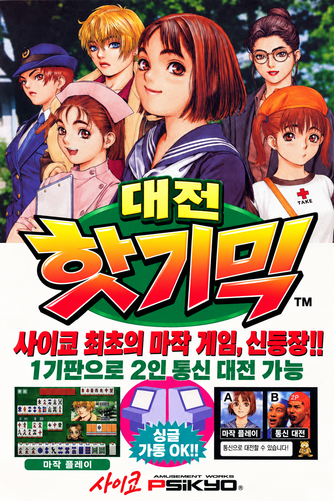

# 대전 핫 기믹 (Taisen Hot Gimmick) 한글 패치

<p align="center"></p>

## 게임 소개

**대전 핫 기믹**(対戦ホットギミック, Taisen Hot Gimmick)은 사이쿄(Psikyo)가 1997년에 내놓은 아케이드 마작 게임입니다. 상대와 1대1로 치는 2인 마작입니다.

- **혼자 하기**: 여고생, 모델, 공원의 소녀, 회사원, 간호사, 여경 등 개성 있는 상대를 골라 승부합니다. 이기면 벌칙(탈의) 연출이 이어집니다.
- **함께 하기**: 기판 하나에 두 화면이 달린 대면형 기체라, 두 사람이 마주 앉아 통신 대전을 할 수 있습니다.
- **도우미 강아지**: 플레이어를 "두목"이라 부르는 도우미 강아지가 진행을 돕습니다. 작파워를 모아 패 바꾸기·패 쌓기·일발 리치 같은 기술도 쓸 수 있습니다.

이 저장소는 이 게임(MAME 세트 `hotgmck`)의 한글화 도구와 번역 데이터입니다. 원본 ROM은 들어 있지 않고, 가지고 있는 원본 ROM으로 한글판 ROM을 만들어 줍니다.

## 버전

| 버전 | 의미 |
|---|---|
| **v1.0** | **정식판**. 모든 대사·그림 글자가 사람 검수를 통과하고(`distribution_eligible`), `--policy release` 빌드가 성공하는 첫 버전 |
| v0.x | 개발판. 검수 전 번역이 들어 있으며 빌드 결과물에 `"distribution": false`가 기록됨 |

**현재 버전: v0.8.0 (개발판)** — 버전 번호의 기준은 [`VERSION`](VERSION) 파일입니다.

v0.8.0에 들어 있는 것:

- 게임 안 대사·안내·메뉴·역 이름·테스트 모드 문자열 438개 전체 (초벌 번역 + 독립 2차 검수 반영)
- 그림 글자 167개 + 타이틀 로고·코인 문구·이름 카드·모드 선택 패널 (아래 표)
- 한글 글꼴: 나눔고딕 15px (대사), 나눔고딕/나눔명조/나눔손글씨 붓 (그림 글자)

v1.0까지 남은 일:

- 사람 검수: 대사 438개, 그림 글자 167개가 모두 `needs_review` 또는 `needs_human_review` 상태
- 게임에서 확인하지 못한 그림 글자 검증: 2대 연결 대전 화면, 엔딩 스태프 크레딧(인명 독음 포함)
- 아직 처리하지 않은 그림 글자: 연결 대전 1P/2P 승패 사진 글자, 역 등급 붓글씨(一·二·満貫 등, 쓰이는 화면 미확인), 미사용 추정 로고 `対戦ジャンファイト`

## 준비물

- Python 3.11 이상, [Pillow](https://pypi.org/project/Pillow/) 9.4 이상, pytest (테스트용)
- 나눔 글꼴 (`/usr/share/fonts/truetype/nanum/`, 데비안 `fonts-nanum`)
- MAME (0.289에서 확인). 데비안에서는 `flatpak install --user flathub org.mamedev.MAME`
- 원본 ROM `hotgmck.zip` — MAME 0.289 기준 `romset hotgmck is good`인 세트. 파일별 크기·SHA1은 [`tools/hotgmck/source.py`](tools/hotgmck/source.py)에 있고, 다르면 빌드가 거부합니다.

## 사용법

```sh
# 1. 한글판 ROM 만들기 → out/hotgmck.zip, out/manifest.json
python3 tools/khpatch.py build --source /경로/hotgmck.zip

# 2. 실행 (MAME Flatpak, 1P 화면만 표시)
./run_ko.sh              # 한글판
./run.sh                 # 원본 (roms/hotgmck.zip)
./run_ko.sh -view "Left-to-Right"   # 1P/2P 두 화면

# 3. 테스트
python3 -m pytest -q tests
```

번역문을 고친 뒤에는 `build`만 다시 실행하면 됩니다. 원본 ROM이 바뀌었거나 추출 규칙을 바꿨다면 먼저 `python3 tools/khpatch.py extract --source hotgmck.zip`으로 번역 표를 다시 맞춥니다(기존 번역은 유지되고, 원문이 달라진 항목은 오류로 알려 줍니다).

조작 (MAME 기본 키): 코인 `5`, 1P 스타트 `1`, 패 선택 `A`~`N`, 론 `Z`, 쯔모 `N`, 깡 `Left Ctrl`, 퐁 `Left Alt`, 치 `Space`, 리치 `Left Shift`.

## 난이도 조절

게임 중 `F2`(서비스 모드)로 테스트 모드에 들어가 `게임 설정`에서 바꿉니다(`A`=아래, `B`=위, `1`=선택). 설정은 `run_test/nvram/`에 저장됩니다.

- 난이도 → `쉬움`
- 플레이어 점수 → 가장 높은 값, CPU 점수 → 가장 낮은 값
- 작파워기술 → `매우 많음`

## 번역 데이터

| 파일 | 내용 |
|---|---|
| [`translation/dialogue.json`](translation/dialogue.json) | 대사 438개. 원문 코드·원문·칸 수·용량(보호 필드)과 번역 `ko`·상태 `state`·메모 `note` |
| [`translation/graphics_text.json`](translation/graphics_text.json) | 그림 글자 167개. 서식 표 주소·스타일·원문(화면에서 옮겨 적음)·번역·상태 |
| [`translation/glossary.json`](translation/glossary.json) | 용어·말투 결정 (강아지 "두목/~슴다", 캐릭터 이름, 역 이름 등)과 승인 상태 |

번역문 규칙:

- 대사의 줄바꿈은 `\n`, 공백은 16px 한 칸을 차지합니다. 문장부호 뒤에는 공백을 넣지 않습니다(칸 절약 규칙).
- 문자열마다 원문 줄 수와 가장 긴 줄의 칸 수를 넘을 수 없고, 넘치면 빌드가 실패합니다.
- 반각 `!?,.~-` 등은 자동으로 전각 글꼴 글자로 바뀝니다. 글꼴에 없는 글자는 빌드 실패입니다.
- 상태: `untranslated` → `in_progress` → `needs_review` → `needs_human_review` → `distribution_eligible`

## 그림 글자 적용 범위 (v0.8.0)

| 묶음 | 수량 | 방법 | 게임에서 확인 |
|---|---|---|---|
| 타이틀 로고 (최종 + 애니메이션 2프레임) | 3 | 제공 이미지(`assets/gfx/title_logo_ko.png`)를 원래 팔레트로 변환 | ✅ |
| 코인 문구 | 2 | 자동 생성 | ✅ |
| 대국 말풍선 (캐릭터 66 + 텐파이/노텐 2) | 68 | 말풍선 배경 유지, 글자만 교체 | ✅ 일부 |
| 강아지 말풍선 | 11 | 〃 | ✅ |
| 컨티뉴 화면 대사 | 29 | 자동 생성 | ✅ 일부 |
| 역 등급·동남서북·장·벌칙 안내·점수 글꼴·자동쯔모·ツモ 패 표시·점수판 바람 | 27 | 자동 생성 | ✅ 일부 |
| 작파워 게이지 표시(雀pow), 패 바꾸기용 버림 패 표시(不要) | 13 | 자동 생성 (빨간 +N 숫자는 원본 유지) | ✅ 작파워 / ❌ 버림 |
| 캐릭터 이름 카드 (흐림 프레임 포함) | 8장 × 5 | 자동 생성 + 가로 흐림 | ✅ (유코 두 번째 카드 제외) |
| 모드 선택 패널, 모니터 조정 화면 | 3 | 원래 글자 지우고(인페인트) 다시 그림 | ✅ |
| 입력 테스트 라벨 | 9 | 자동 생성 (팔레트 없는 두 색 방식) | ✅ 일부 |
| 2대 연결 대전 (기술명 12, 컨티뉴 대사 6) | 18 | 자동 생성 | ❌ 연결 가동 전용 |
| 엔딩 스태프 크레딧 | 4 | 자동 생성 (팔레트 없는 두 색 방식) | ❌ |

영어 그림 글자(CONTINUE?, GAME OVER, 캐릭터 영어 소개 등)와 회사 로고는 그대로 둡니다.

## 구조

```
tools/khpatch.py          진입점 (extract / build)
tools/hotgmck/source.py   지원 원본 ROM 프로필 (크기·SHA1)
tools/hotgmck/layout.py   CPU/그래픽 영역 ↔ ROM 칩 파일 좌표 변환
tools/hotgmck/charmap.py  원본 글리프 코드표, 한글 슬롯 배정
tools/hotgmck/textblock.py 대사 블록 파싱·레이아웃·인코딩
tools/hotgmck/graphics.py 그림 글자 합성 (팔레트 근사, 말풍선, 카드, 인페인트 등)
tools/hotgmck/writeplan.py 쓰기 계획: 원본 기대값 검증, 겹침·설명 안 되는 변경 거부, 전부 아니면 전무
tools/hotgmck/build.py    추출과 제품 빌드
tests/                    계약 테스트 (가짜 ROM 세트로 빌드 전 과정 포함)
docs/initial-survey.md    분석 결과: ROM 구조, 대사 엔진, 그림 글자 목록, 사람 결정 기록
```

빌드는 원본 13개 파일의 SHA1을 확인한 뒤, 모든 변경을 원본 기대 바이트가 붙은 쓰기 계획으로 등록하고, 겹침·기대값·최종 차이를 검사한 다음 한 번에 적용합니다. 번역이 하나도 없으면 결과가 원본과 바이트 단위로 같습니다.

## 권리

- 이 저장소에는 원본 ROM이나 원본에서 뽑아낸 그래픽·글꼴 덤프가 들어 있지 않습니다. 번역 표에는 원본 대사 문자열과 코드가 들어 있습니다(재삽입에 필요).
- 원작 게임의 권리는 권리자에게 있습니다. 합법적으로 가진 ROM에만 적용하세요.
- 나눔 글꼴은 SIL Open Font License입니다(저장소에 포함하지 않고 시스템 글꼴을 사용).
- `assets/gfx/title_logo_ko.png`는 프로젝트 소유자가 제공한 한글 로고 이미지입니다. 배포 전에 이용 권리를 확인해야 합니다.
- `docs/poster.png`는 프로젝트 소유자가 제공한 한글판 포스터 이미지입니다(원작 캐릭터 그림 포함). 배포 전에 이용 권리를 확인해야 합니다.
